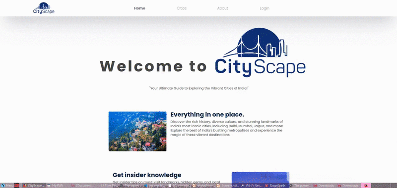

# My-City-Information [CityScape]
  
CityScape is a MERN project that provides comprehensive information about various cities.

## Features

- **City Information**: Each city is displayed with its own set of attractions, hospitals, schools, colleges, and police stations.
- **Interactive Map**: The information for each city is displayed on an interactive map using the Leaflet library.
- **Transport Information**: Each city also provides information about local transport, including trains and buses.

## Installation
1. Clone the repository: `git clone https://github.com/akshaj65/My-City-Information.git`
2. Navigate to the project directory: `cd My-City-Information`
3. Install the frontend dependencies: `cd frontend && npm install`
4. Install the backend dependencies: `cd ../backend && npm install`
5. Start the backend server: `npm start`
6. Start the frontend server: `cd ../frontend && npm start`

## Usage

Visit `http://localhost:3000` in your browser to view the application.

## Contributing

Pull requests are welcome. For major changes, please open an issue first to discuss what you would like to change.

